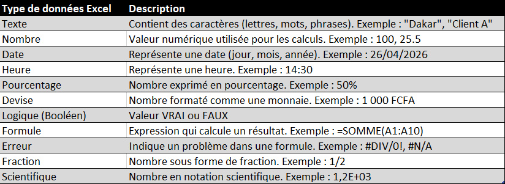
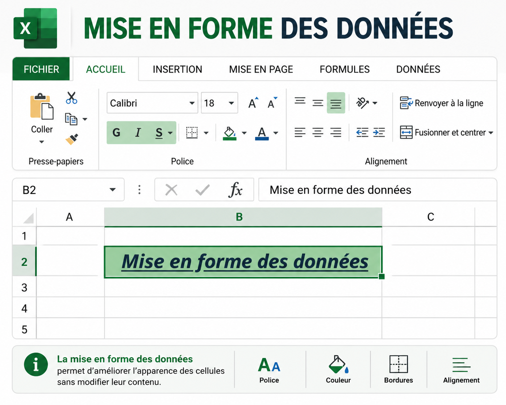

# Module 2 – Saisie et Mise en forme

## Objectif pédagogique
À la fin de ce module, tu dois être capable de :
- Saisir des données propres, structurées et exploitables dans Excel
- Identifier et utiliser correctement les types de données
- Corriger et modifier des cellules sans casser la structure du tableau
- Appliquer une mise en forme professionnelle (style Excel)
- Utiliser les formats de nombres pour rendre les données lisibles et exploitables

---

## 1. Introduction : la règle d’or d’Excel

Dans Excel, une vérité est essentielle :

> Une mauvaise saisie = une mauvaise analyse

Excel ne “corrige pas” tes données. Il les exécute.

Si tu entres des données mal structurées :
- tes formules seront fausses
- tes graphiques seront incohérents
- tes analyses seront inutilisables

👉 Un bon utilisateur Excel commence toujours par des données propres (clean data).

---

## 2. Types de données dans Excel

Excel reconnaît plusieurs types de données. Les maîtriser est fondamental.

  

---

### 2.1 Le texte (Text / String)

Le texte correspond à toute donnée non calculable.

Exemples :
- Nom de produit
- Catégorie
- Ville
- Client

Comportement Excel :
- Aligné à gauche par défaut
- Non utilisé dans les calculs
- Peut servir de critère de tri ou filtre

👉 Exemple professionnel :
“Fourniture bureau”, “Transport”, “Marketing”

---

### 2.2 Les valeurs numériques (Number)

Les nombres sont les données exploitables dans les calculs.

Exemples :
- Prix
- Quantité
- Montant
- Taux

Comportement Excel :
- Aligné à droite par défaut
- Utilisé dans toutes les formules (SOMME, MOYENNE, etc.)

👉 Attention :
Un nombre stocké en texte ne sera pas calculé.

---

### 2.3 Les dates (Date / Time)

Les dates sont des valeurs numériques masquées.

Exemples :
- 01/01/2025
- 15/03/2026

Comportement Excel :
- Permet le calcul de durées
- Utilisé dans les analyses temporelles
- Peut être trié chronologiquement

👉 Exemple métier :
suivi des dépenses mensuelles, échéances, planning

---

## 3. Saisie et modification des données

---

### 3.1 Saisie de données (Data Entry)

Procédure standard :
1. Sélectionner une cellule
2. Saisir la valeur
3. Valider avec Entrée

👉 Bonne pratique :
Toujours vérifier la cellule active avant de saisir.

---

### 3.2 Modification de cellule

Deux méthodes professionnelles :

- Double-clic dans la cellule (édition directe)
- Barre de formule (méthode la plus propre pour éviter les erreurs)

👉 Astuce Excel :
La barre de formule est plus fiable pour les longues valeurs ou formules.

---

### 3.3 Suppression de données

- Touche Suppr (Delete)
- Ou effacer le contenu sans casser la structure

⚠️ Attention :
Ne jamais supprimer une cellule sans comprendre son impact sur les formules.

---

## 4. Mise en forme des données (Data Formatting)

La mise en forme ne change pas les données, seulement leur apparence.

---

### 4.1 Mise en forme du texte

Dans l’onglet Accueil, groupe Police :

- Gras (Bold)
- Taille de police
- Couleur du texte
- Style de police

  

  

👉 Objectif :
Améliorer la lisibilité et hiérarchiser l’information.

---

### 4.2 Alignement des cellules

Dans le groupe Alignement :

- Alignement horizontal : gauche, centre, droite
- Alignement vertical : haut, milieu, bas

👉 Exemple professionnel :
- Titres centrés
- Données alignées à droite (valeurs numériques)

---

### 4.3 Bordures (Borders)

Les bordures permettent de structurer visuellement un tableau.

Utilisation :
- Délimiter un tableau
- Séparer les en-têtes des données
- Améliorer la lecture

👉 Bonne pratique :
Toujours encadrer un tableau complet.

---

### 4.4 Couleur de remplissage (Fill Color)

Permet de hiérarchiser les informations.

Exemples :
- En-têtes en couleur
- Totaux mis en évidence
- Sections importantes surlignées

👉 Astuce Excel :
Utiliser des couleurs sobres pour garder un aspect professionnel.

---

## 5. Formats de données (Number Formatting)

---

### 5.1 Format monétaire

Permet d’afficher les valeurs financières correctement.

Exemple :
50000 → 50 000 (avec séparateur de milliers)

👉 Utilisation :
budgets, dépenses, revenus

---

### 5.2 Format pourcentage

Convertit une valeur décimale en pourcentage.

Exemple :
0,25 → 25 %

👉 Utilisation :
taux, ratios, performance

---

### 5.3 Format date

Permet d’afficher et d’exploiter des dates.

Exemple :
01/01/2025

👉 Utilisation :
planning, suivi, analyse temporelle

---

## 6. Cas pratique – Budget mensuel professionnel

---

### 6.1 Objectif
Créer un tableau structuré et exploitable pour analyser un budget mensuel.

---

### 6.2 Données à saisir

Copie ce tableau dans Excel :

| Catégorie   | Montant |
|------------|----------|
| Loyer      | 150000   |
| Nourriture | 50000    |
| Transport  | 20000    |
| Internet   | 15000    |
| Loisirs    | 10000    |

---

### 6.3 Étapes professionnelles

#### Étape 1 : Structuration
- Vérifier que chaque donnée est dans la bonne cellule
- Ne pas mélanger texte et nombres dans une même colonne

---

#### Étape 2 : Mise en forme des en-têtes
- Mettre la ligne 1 en gras
- Centrer les titres
- Appliquer une couleur de fond légère

---

#### Étape 3 : Format des montants
- Sélectionner la colonne des montants
- Appliquer un format monétaire
- Vérifier l’alignement à droite

---

#### Étape 4 : Amélioration visuelle
- Ajouter des bordures complètes
- Uniformiser les colonnes
- Ajuster la largeur des colonnes (AutoFit)

---

### 6.4 Résultat attendu

Tu dois obtenir :
- Un tableau propre et structuré
- Des données lisibles et alignées
- Une présentation professionnelle prête pour analyse

---

## 7. Évaluation des acquis

Explique clairement la différence entre :
- une donnée de type texte
- une donnée de type nombre

et donne un exemple concret pour chacun.

---

## 8. Recommandations professionnelles

- Toujours structurer les données avant de formater
- Ne jamais mélanger texte et chiffres dans une même colonne
- Éviter les couleurs excessives
- Penser “analyse” avant “esthétique”
- Travailler comme un analyste, pas comme un simple utilisateur

---

## Conclusion

La saisie et la mise en forme sont la base de tout travail sérieux sur Excel.

Un bon fichier Excel ne commence pas par des formules…  
il commence par des données propres, bien structurées et bien présentées.

---

⬅️ Module précédent : [Module 1 – Interface et Navigation](Docs/module1.md)  

📍 Module actuel : Module 2 – Saisie et Mise en forme 

➡️ Module suivant : [Module 3 – Calculs de base](Docs/module3.md)

🏠 Accueil : [Programme Excel](../README.md)
