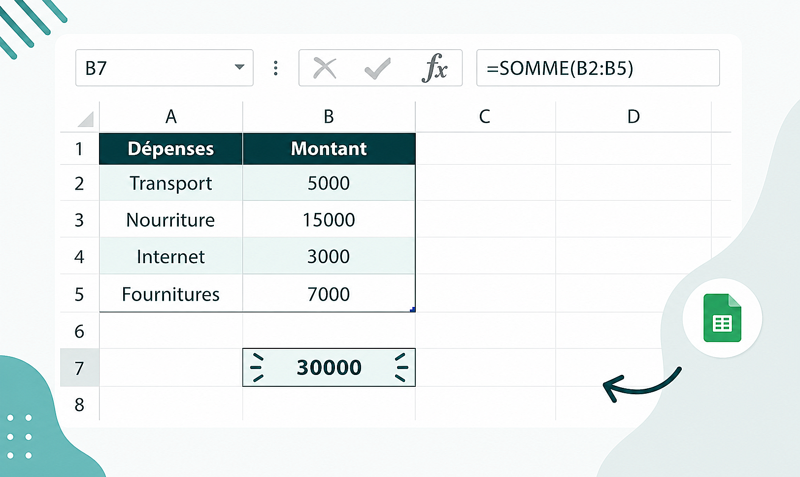
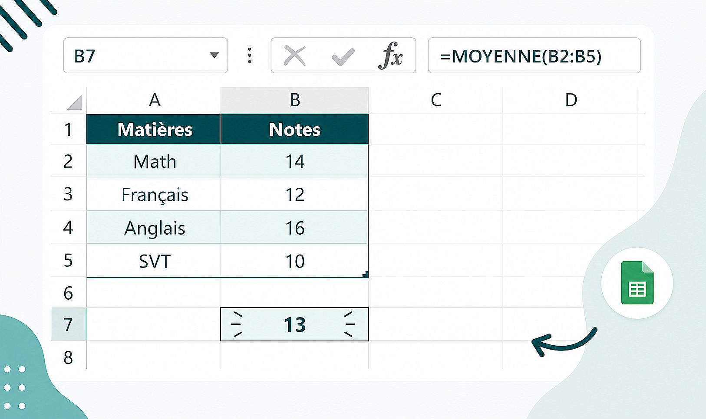
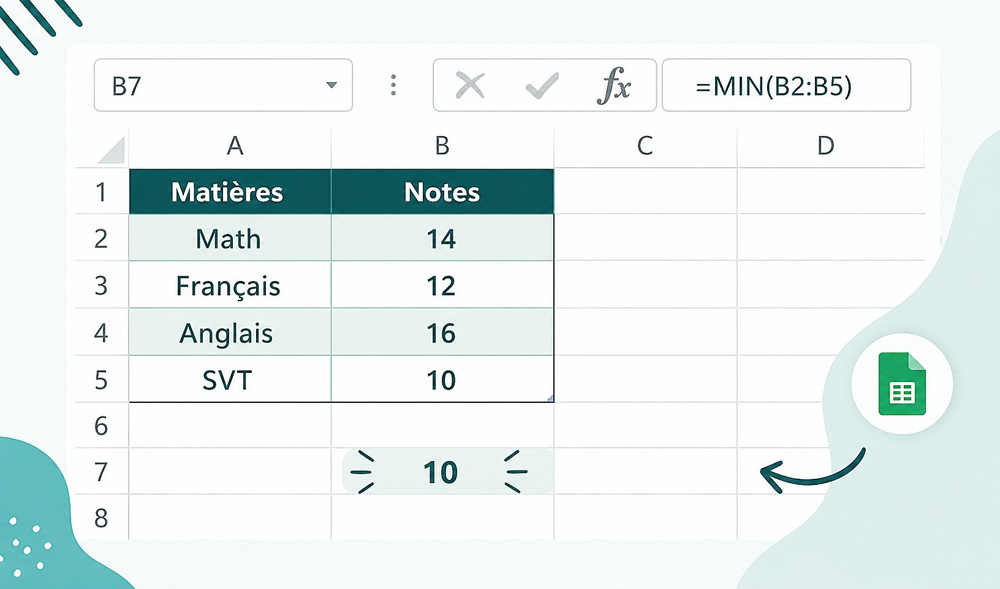
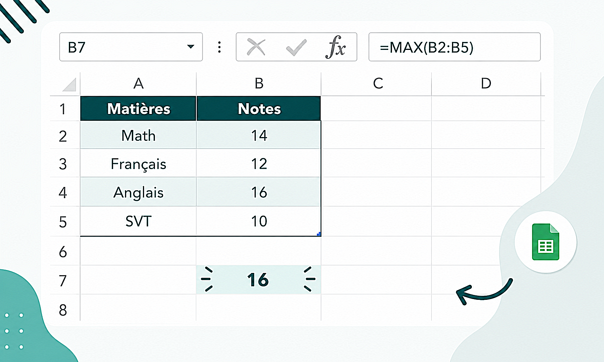
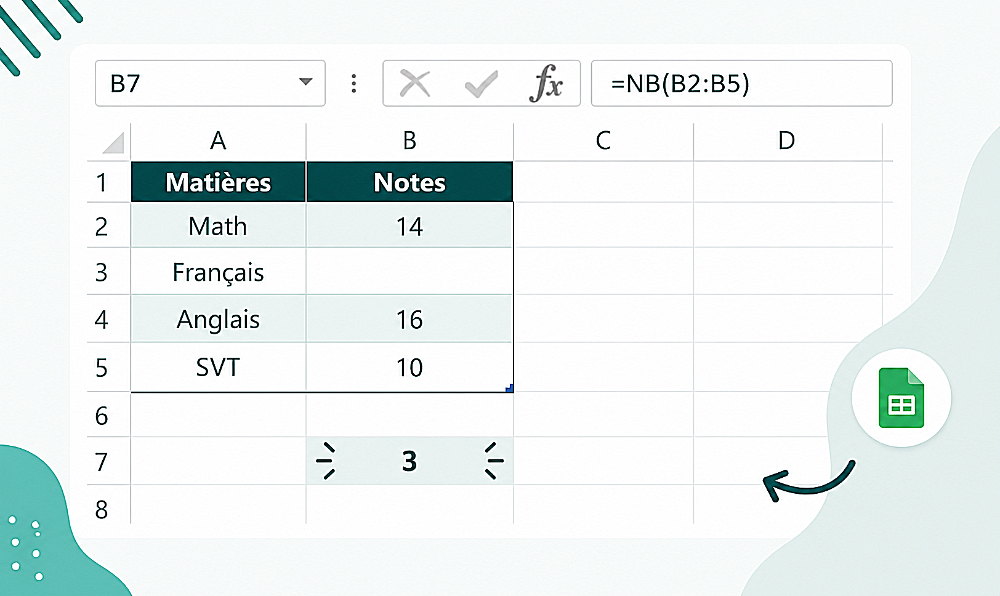
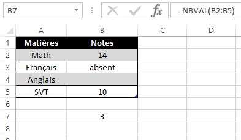
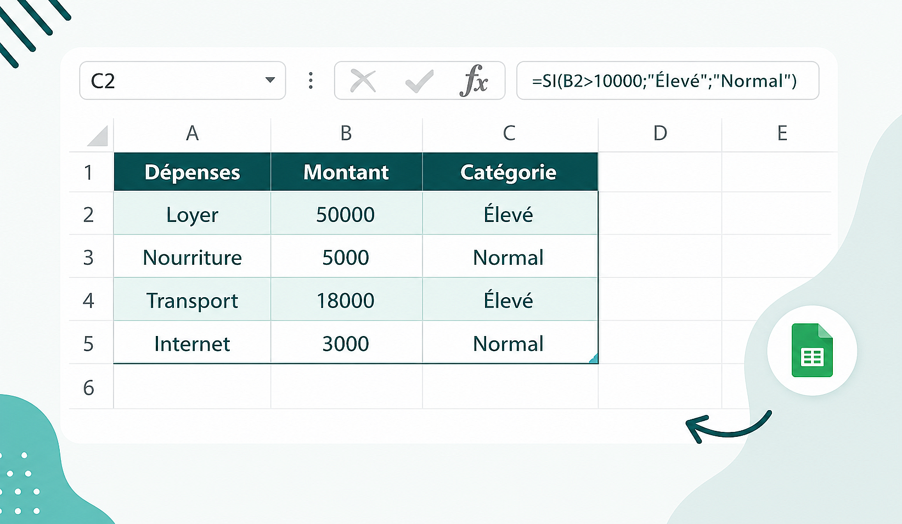

# Module 3 – Calculs de base (Formules et Fonctions Excel)

## Objectif pédagogique
À la fin de ce module, tu dois être capable de :
- Comprendre la logique des formules Excel (et ne plus en avoir peur)
- Construire des calculs simples et fiables
- Utiliser les fonctions essentielles d’Excel en autonomie
- Comprendre la syntaxe d’une fonction comme un langage
- Recopier des formules sans erreur

---

## 1. Introduction : comprendre la logique d’Excel

Excel n’est pas un logiciel “magique”. Il fonctionne avec une règle très simple :

> Tout calcul commence par le signe égal (=)

Sans ce signe, Excel considère que tu écris du texte.

---

### Exemple concret

- A1 = 5000  
- B1 = 3000  

Formule :
= A1 + B1  

Résultat :
8000

👉 Excel ne calcule que ce que tu lui demandes explicitement.

---

## 2. Les opérations de base (le langage des calculs)

Excel utilise des opérateurs mathématiques standards.

| Opération        | Symbole | Exemple        | Résultat |
|-----------------|--------|----------------|----------|
| Addition        | +      | =A1+B1         | Somme    |
| Soustraction    | -      | =A1-B1         | Différence |
| Multiplication  | *      | =A1*B1         | Produit  |
| Division        | /      | =A1/B1         | Quotient |

---

### Point important (niveau professionnel)
Toujours privilégier les références de cellules plutôt que les valeurs fixes.

❌ Mauvais :
=5000+3000  

✔️ Bon :
=A1+B1  

👉 Pourquoi ?
Parce que si les données changent, ton calcul s’actualise automatiquement.

---

## 3. Les références de cellules (le cœur d’Excel)

Une référence de cellule est l’adresse d’une donnée.

Exemple :
- A1 = 5000
- B1 = 3000

Formule :
= A1 + B1 → 8000

---

### Ce que tu dois comprendre

Excel fonctionne comme un système dynamique :
- Tu changes une valeur
- Tous les résultats se mettent à jour automatiquement

👉 C’est ce qui fait la puissance d’Excel.

---

## 4. Les fonctions Excel (niveau fondamental)

### 4.1 Définition simple
Une fonction est une formule préconçue qui exécute un calcul automatiquement.

Au lieu d’écrire :
=A1+A2+A3+A4  

Tu peux écrire :
=SOMME(A1:A4)

---

## 4.2 Syntaxe d’une fonction (très important)

Structure générale :

= NOM_FONCTION(argument1 ; argument2 ; ...)

---

### Explication simple mais essentielle

- = → démarre le calcul
- NOM_FONCTION → ce que tu veux faire (SOMME, MOYENNE…)
- Arguments → les données utilisées
- ; → sépare les arguments

---

### Deux types d’arguments

- Cellules individuelles : A1 ; A2
- Plages : A1:A10

---

## 5. Les fonctions essentielles (à maîtriser absolument)

---

## 5.1 SOMME (la fonction la plus utilisée)

### Rôle :
Additionner une série de valeurs

### Syntaxe :
=SOMME(plage)

### Exemple :
=SOMME(B2:B5)

  

👉 Addition automatique de toutes les valeurs de B2 à B5

---

### Utilisation réelle :
- budgets
- ventes
- dépenses
- totaux généraux

---

## 5.2 MOYENNE

### Rôle :
Calculer la valeur moyenne

### Syntaxe :
=MOYENNE(plage)

### Exemple :
=MOYENNE(B2:B5)

  

---

### Utilisation réelle :
- moyenne des dépenses
- moyenne des notes
- performance moyenne

---

## 5.3 MIN

### Rôle :
Trouver la plus petite valeur

### Syntaxe :
=MIN(plage)

### Exemple :
=MIN(B2:B5)

  

---

### Utilisation réelle :
- dépense minimale
- plus petite vente
- valeur la plus basse

---

## 5.4 MAX

### Rôle :
Trouver la plus grande valeur

### Syntaxe :
=MAX(plage)

### Exemple :
=MAX(B2:B5)

  

---

### Utilisation réelle :
- plus grosse dépense
- meilleure performance
- valeur maximale

---

## 5.5 NB

### Rôle :
Compter uniquement les cellules contenant des nombres

### Syntaxe :
=NB(plage)

### Exemple :
=NB(B2:B5)

  

---

## 5.6 NBVAL

### Rôle :
Compter toutes les cellules non vides

### Syntaxe :
=NBVAL(plage)

### Exemple :
=NBVAL(A2:A5)

  

---

## 5.7 SI (fonction logique essentielle)

### Rôle :
Faire une comparaison logique

---

### Syntaxe :
=SI(condition ; valeur_si_vrai ; valeur_si_faux)

---

### Explication claire

- condition → test (ex : B2 > 30000)
- valeur_si_vrai → résultat si vrai
- valeur_si_faux → résultat si faux

---

### Exemple concret :
=SI(B2>30000 ; "Élevé" ; "Normal")

  

---

### Utilisation réelle :
- classification des dépenses
- validation de performance
- prise de décision automatique

---

## 6. Recopie des formules (gain de productivité)

### Principe
Tu n’as pas besoin de refaire une formule ligne par ligne.

---

### Méthode professionnelle
- sélectionner la cellule
- utiliser la poignée de recopie (petit carré en bas à droite)
- glisser vers le bas

---

### Ce que fait Excel automatiquement
- adapte les références (A1 devient A2, A3…)
- conserve la logique du calcul

---

## 7. Cas pratique – Analyse de budget

---

## 7.1 Données à saisir

| Catégorie   | Montant |
|------------|----------|
| Loyer      | 150000   |
| Nourriture | 50000    |
| Transport  | 20000    |
| Internet   | 15000    |

---

## 7.2 Étapes d’analyse

### Étape 1 : Total des dépenses
=SOMME(B2:B5)

---

### Étape 2 : Moyenne
=MOYENNE(B2:B5)

---

### Étape 3 : Minimum
=MIN(B2:B5)

---

### Étape 4 : Maximum
=MAX(B2:B5)

---

### Étape 5 : Analyse avec SI

Dans C2 :
=SI(B2>30000;"Dépense élevée";"Dépense normale")

Puis recopier vers le bas.

---

## 7.3 Résultat attendu

Tu obtiens :
- un total automatique
- une moyenne claire
- une vision des extrêmes (MIN / MAX)
- une analyse intelligente des dépenses

---

## 8. Bonnes pratiques professionnelles

- Toujours commencer une formule par =
- Toujours utiliser des plages (A1:A10) plutôt que des cellules isolées
- Vérifier les parenthèses
- Ne jamais mélanger texte et nombres dans une même colonne
- Tester les formules sur de petites données avant de les généraliser

---

## 9. Évaluation des acquis

Explique clairement :

- la structure d’une fonction Excel
- le rôle des arguments
- et donne un exemple concret d’une fonction que tu as utilisée

---

## Conclusion du module

Les formules sont le cœur d’Excel.

Si tu comprends ce module :
- tu passes de simple utilisateur
- à utilisateur capable d’automatiser des calculs

C’est ici que commence la vraie puissance d’Excel.

---

⬅️ Module précédent : [Module 2 – Saisie et Mise en forme](module2.md)  

📍 Module actuel : Module 3 – Calculs de base 

➡️ Module suivant :  [Module 4 – Organisation et Graphiques](module4.md)

🏠 Accueil : [Programme Excel](../README.md)
